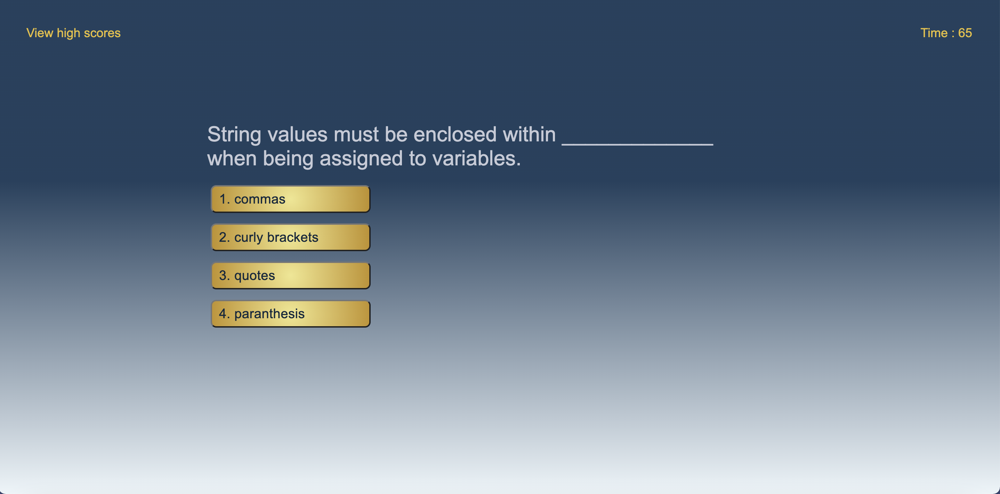
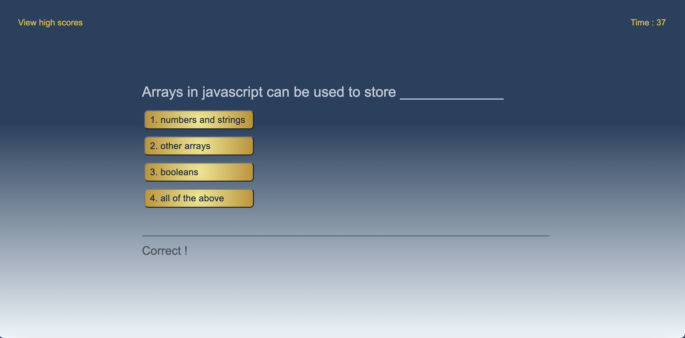
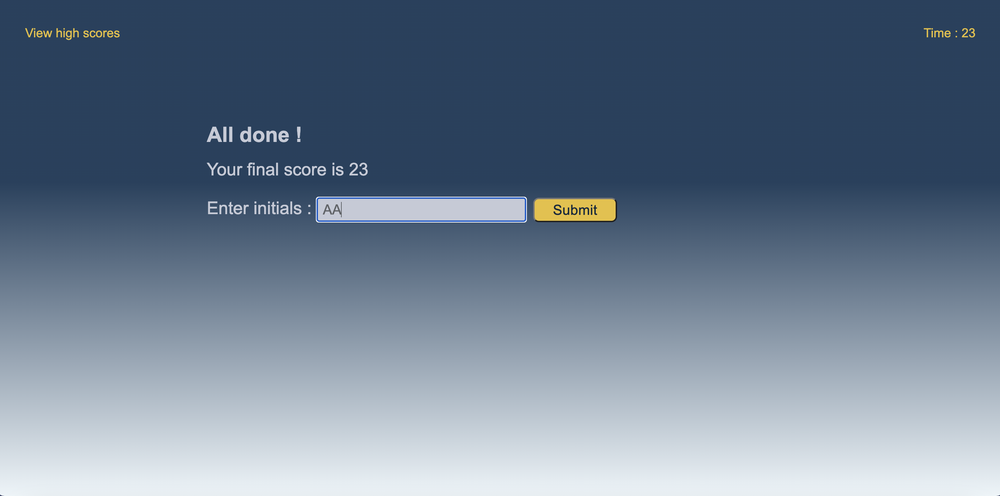
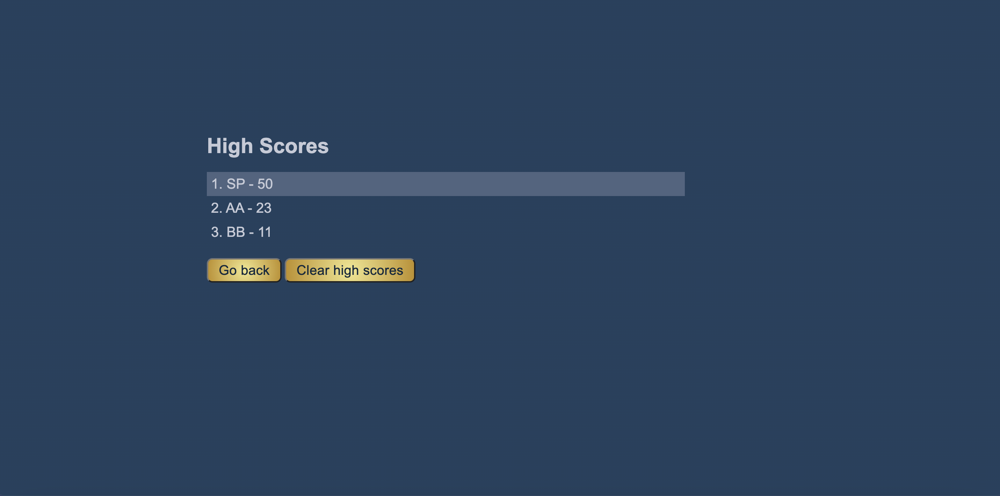
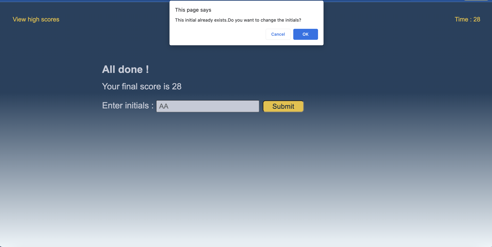

# Code Quiz Webpage

## Description

This application helps user to attend a timed coding quiz with multiple-choice questions. When the user starts the quiz a timer will start and user can attend a series of questions with multiple choices. The quiz will be finished either when  all the questions are answered or the timer becomes zero. User can save the score and initials. There will be a time penalty of 15 seconds for each wrong answers.Timer count will be reduced by 15 seconds. This application also keeps track of the high scores along with initials saved by the users.So the user can compare their progress with their peers.The application is built with a responsive layout which makes it adaptable to different screen sizes.

## Installation

N/A

## Usage

The user is presented with a link to view the high scores,a timer count which is zero initially and a button to start the quiz when the application is opened. Up on clicking the button the timer starts and the user will be presented with the first question with multiple choices. When the answer is clicked then the next question and choices will be displayed. If the user clicks a wrong answer then the time will be reduced by 15 seconds. This process will be repeated until all questions are answered or timer reaches zero. When the quiz is finished the user will be presented with a form to enter his/her initials and save the scores. Up on clicking the submit button the application checks whether the initial already exists or not.If it already exists a confirmation message will be displayed to continue with the initial or change it. After saving the score ,the user will be redirected to another page which showcases the high scores of the quiz with the highest score highlighted on top of the list .This page also includes a buttons for clearing the high scores and another button to go back to the home page.

The following images show the web application's appearance and functionality   :

Validation

Link to website  :

https://shimna-puthanayil.github.io/code-quiz/

## Credits

References

https://developer.mozilla.org/en-US/docs/Web/JavaScript/Reference/Global_Objects/Object/values

https://stackoverflow.com/questions/16562577/how-can-i-make-a-button-redirect-my-page-to-another-page

https://developer.mozilla.org/en-US/docs/Web/API/Storage/removeItem

https://stackoverflow.com/questions/4550505/getting-a-random-value-from-a-javascript-array

## License

MIT license.
